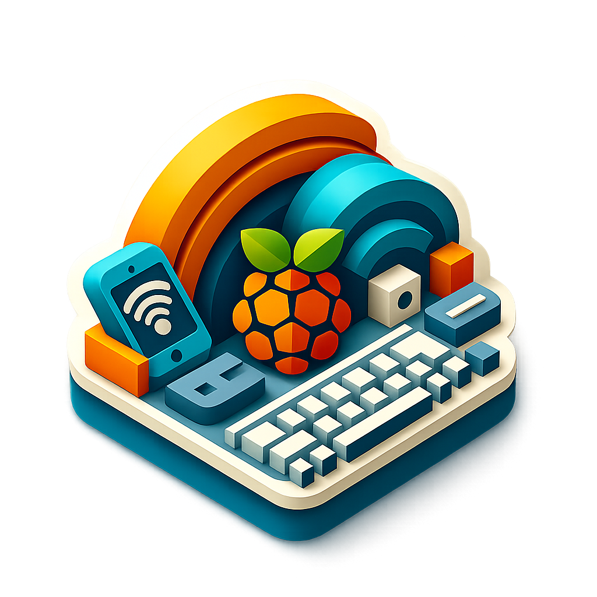

# AnyKBoard Server

**AnyKBoard Server** is the desktop companion app for **AnyKBoard App**.  
It allows you to use your smartphone as a **wireless keyboard and clipboard input device** over a local network.

Designed for developers, security testers, and hardware enthusiasts.

---

## Features

- Use your phone as a wireless keyboard  
- Send text directly to the PC clipboard  
- Pair securely using a QR code  
- Local network (LAN) communication  
- Cross-platform: Windows, macOS, Linux  
- Open source and lightweight  

---

## How It Works

1. Install and launch AnyKBoard Server on your computer  
2. A QR code will be displayed  
3. Open the AnyKBoard Android/IOS app  
4. Scan the QR code to pair  
5. Start typing from your phone  

> Phone and computer must be on the same local network.

---

## Permissions & Notes

- **Network access** is required to run the local socket server  
- **macOS** requires Accessibility permission to send keystrokes  
- On **Windows**, installation location is user-defined and shortcuts are not created by default  
- Ensure the detected IP address matches your LAN  

⚠️ Try not to use this app to cheat in coding assessments or evaluations.

---

## Intended Use

For productivity, development, automation, and **authorized security testing only**.  
Users are responsible for complying with applicable laws and policies.

---

## Android Client

Download the official **AnyKBoard** app from the Google Play Store.

---

## License

This project is licensed under the MIT License.
